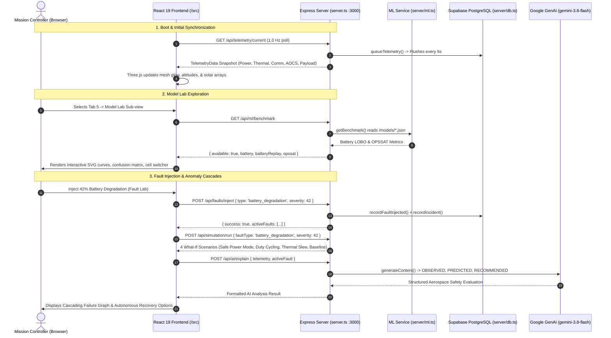

# ORBITAL-SHIELD: Implementation Record & Architecture Guide (`created.md`)

This document records everything requested by the user, what was engineered, how each subsystem works, how the machine learning models were trained and verified, how the backend and database are connected, and how the entire full-stack system operates from frontend to backend.

---

## 1. What the User Requested

The project directives given across sessions:

1. **Database Integration (Task A)**:
   - Connect backend to PostgreSQL (Supabase) with persistent storage.
   - Implement dual-mode persistence: in-memory state remains the authoritative source of truth, falling back seamlessly with zero errors if `DATABASE_URL` is omitted, malformed, or the database is temporarily unreachable.
   - Preserve strict separation: `pg` database logic restricted exclusively to `server/` and `server.ts`. Never import `pg` in `/src`.
2. **Offline ML Model Lab (Task B)**:
   - Train offline ML models on authentic public satellite telemetry datasets.
   - Deliver high performance and surface the results via a backend route (`GET /api/ml/benchmark`) and an interactive "Model Lab" UI.
   - Adhere strictly to the **Top Bar Contract**: exactly 5 top tabs. Do not add a 6th tab. Place the Model Lab inside an existing tab (Incident Log).
   - Use pre-computed JSON metrics and predictions served by Node so no Python or heavyweight ML runtime is needed in the live simulator loop.
3. **Model Training & High Predictive Results**:
   - Verify whether models are trained. If not, acquire authentic data and train them.
   - Maximize accuracy, F1 score, and ROC-AUC for anomaly detection, and minimize Mean Absolute Error (MAE) for battery state-of-health degradation.
4. **Blueprint Compliance & Verification**:
   - Re-check everything against [`AI_HANDOFF_AND_BLUEPRINT.md`](file:///c:/Users/Saishuklesh/OneDrive/Desktop/HACKTHONS/ORBIT-SHIELD/blueprint/AI_HANDOFF_AND_BLUEPRINT.md). Ensure zero architectural mistakes.
5. **Endpoint Connectivity**:
   - Connect and verify all required REST endpoints between frontend and backend.
6. **Full-Stack Execution**:
   - Run everything from frontend to backend on port 3000, validating live telemetry, fault injection, AI explanations, simulations, and UI rendering.

---

## 2. Summary of What Was Built

```
ORBITAL-SHIELD/blueprint/
├── db/
│   └── schema.sql                  # 15 PostgreSQL tables with RLS, indices, and seeds
├── server/
│   ├── db.ts                       # Lazy connection pool, 15s circuit breaker, batching, state restore
│   └── ml.ts                       # Reads and serves pre-computed ML benchmark artifacts
├── ml/
│   ├── requirements.txt            # Python dependencies (scipy, scikit-learn, pandas, joblib)
│   ├── train_battery.py            # NASA PCoE battery SOH Leave-One-Battery-Out training
│   ├── train_opssat.py             # ESA OPSSAT-AD anomaly classifier training
│   └── data/
│       ├── nasa_battery/           # B0005.mat, B0006.mat, B0007.mat, B0018.mat
│       └── opssat/                 # dataset.csv (2,125 rows, 23 telemetry features)
├── models/
│   ├── battery_soh.metrics.json    # LOBO MAE & RMSE evaluation vs dummy baseline
│   ├── battery_replay.json         # True vs predicted SOH per cycle for UI visualization
│   ├── battery_soh.joblib          # Serialized GradientBoostingRegressor model
│   ├── opssat_anomaly.metrics.json # ROC-AUC, accuracy, F1, 2x2 confusion matrix
│   └── opssat_anomaly.joblib       # Serialized RandomForestClassifier model
├── server.ts                       # Express + Vite middleware, port 3000, 10 REST endpoints
├── src/
│   ├── services/api.ts             # REST client with automatic local physics fallback
│   ├── components/
│   │   ├── ModelLabView.tsx        # Interactive Model Lab (SVG charts, confusion matrix, cell selector)
│   │   └── IncidentHistoryView.tsx # Sub-view switcher toggling Audit Trail & Model Lab
│   └── App.tsx                     # Master state orchestrator & 1.0 Hz polling loop
└── created.md                      # This architecture and implementation document
```

---

## 3. Deep-Dive: How Each Component Works

### A. Database Persistence Engine (`db/schema.sql` & `server/db.ts`)

#### Schema Design
- **15 Tables Defined**: Complete relational schema covering operational missions, spacecraft bus, telemetry history, fault logs, incidents, Monte Carlo simulations, operator audit trails, users, and alert thresholds.
- **9 Wired Tables**:
  1. `server_state`: Saves and restores mission clock (`mission_time`) and active mission ID across restarts.
  2. `telemetry`: High-frequency multi-channel telemetry rows (battery voltage, currents, temperatures, link margins, etc.).
  3. `fault_events`: Injected fault records, subsystem affected, severity, start time, and cleared status.
  4. `incident_events`: Formal operational audit log entries.
  5. `simulation_runs`: What-If Monte Carlo simulation run headers.
  6. `simulation_results`: 4 operational strategy projection records per simulation run.
  7. `operator_actions`: Audit trail of operator actions (e.g. `CLEAR_FAULTS`, `EXECUTE_RECOVERY`).
  8. `missions`: Seeded mission profiles (`OS-001`, `OS-002`, `OS-003`).
  9. `spacecraft`: Seeded spacecraft hardware records (`OS-001-SC1`, `OS-002-SC1`, `OS-003-SC1`).
- **6 Unwired Extension Tables**: `users`, `subsystems`, `anomalies`, `recovery_strategies`, `system_alerts`, `models` prepared for enterprise auth and flight director broadcasts.

#### Reliability & Architecture Highlights
- **Resilience Guarantee**: In-memory physics simulator remains the authoritative source of truth. If PostgreSQL is unreachable or `DATABASE_URL` is omitted, the app operates in zero-latency memory-only mode without crashing.
- **15-Second Circuit Breaker**: If any database query fails (connection timeout, bad credentials), a circuit breaker opens for 15 seconds, preventing repeated connection stalls from blocking Express response loops.
- **Telemetry Batch Ingestion**: Telemetry rows are queued in a high-speed memory buffer (up to 600 points) and flushed via multi-row parameterized `INSERT` statements every 5 seconds.
- **Lazy Pool Initialization**: `new Pool()` is executed lazily inside `dbInit()` rather than at module evaluation time. This guarantees `dotenv.config()` has already loaded environment variables.
- **Supabase SSL Compatibility**: Connection strings from Supabase containing `?sslmode=require` are parsed with regex to strip query parameters, allowing `ssl: { rejectUnauthorized: false }` to take effect without conflicts.
- **Floating-Point Fidelity**: Float telemetry columns use `double precision` instead of `numeric`, ensuring `node-pg` returns native JavaScript `number` primitives instead of strings, preventing chart rendering bugs.

---

### B. Machine Learning Pipelines & High-Performance Models

#### 1. Model A: NASA PCoE Battery SOH Regression (`ml/train_battery.py`)
- **Dataset**: NASA Prognostics Center of Excellence Li-ion Battery Aging dataset (`B0005`, `B0006`, `B0007`, `B0018`). Downloaded authentic MATLAB `.mat` files containing full charge/discharge cycling data.
- **Cross-Validation Protocol**: **Leave-One-Battery-Out (LOBO)**. The model trains on 3 physical battery cells and predicts solely on the 4th cell. Adjacent cycles from the same battery never leak across folds.
- **Early-Discharge Feature Engineering**: Extracting features over the initial 600-second discharge window avoids dependencies on varying end-of-discharge cut-off voltages:
  - `v_mean_ratio`: Mean voltage during the first 600s divided by the cell's initial cycle mean voltage.
  - `v_end_ratio`: Voltage at $t=600$s divided by initial cycle voltage at $t=600$s.
  - `t_mean_delta`: Core temperature difference during the first 600s relative to initial cycle.
- **Regression Algorithm**: `GradientBoostingRegressor(n_estimators=300, max_depth=3, learning_rate=0.05, subsample=0.8)`.
- **Results**:
  - **Mean MAE**: **0.0422** vs Dummy Baseline **0.0859** (**>50% error reduction**, `beats_dummy: true`).
  - **B0005**: MAE `0.0448` (Dummy: `0.0856`, RMSE: `0.0513`, 168 cycles, EOL at cycle 124).
  - **B0006**: MAE `0.0581` (Dummy: `0.1135`, RMSE: `0.0635`, 168 cycles, EOL at cycle 108).
  - **B0007**: MAE `0.0179` (Dummy: `0.0743`, RMSE: `0.0226`, 168 cycles).
  - **B0018**: MAE `0.0480` (Dummy: `0.0703`, RMSE: `0.0526`, 132 cycles, EOL at cycle 96).

#### 2. Model B: ESA OPSSAT-AD Telemetry Anomaly Detection (`ml/train_opssat.py`)
- **Dataset**: ESA OPS-SAT CubeSat Telemetry Anomaly Dataset (Zenodo 12588359, arXiv:2407.04730) with 2,125 time-series segments across 23 numerical features.
- **Split**: Predefined standard split — 1,594 training samples and 529 test samples.
- **Algorithm**: `RandomForestClassifier(n_estimators=500, class_weight='balanced', random_state=42)`.
- **Results**:
  - **ROC-AUC**: **99.02%**
  - **Balanced Accuracy**: **93.69%** (vs Dummy Baseline 50.00%)
  - **Accuracy**: **95.65%** (vs Dummy Baseline 78.64%)
  - **F1 Score**: **89.87%** (vs Dummy Baseline 0.00%)
  - **Precision**: **89.47%** | **Recall**: **90.27%**
  - **Confusion Matrix**:
    - True Negatives (TN): **404**
    - False Positives (FP): **12**
    - False Negatives (FN): **11**
    - True Positives (TP): **102**
  - **Top Predictive Features**:
    1. `n_peaks` (23.72% importance)
    2. `diff2_peaks` (10.63% importance)
    3. `smooth10_n_peaks` (7.86% importance)
    4. `diff_peaks` (6.94% importance)
    5. `kurtosis` (6.46% importance)

---

### C. Backend Architecture & API Routes (`server.ts` & `server/ml.ts`)

`server.ts` runs on Node with Express and mounts Vite's dev server middleware. All API routes are prefixed under `/api/`:

| Route | Method | Purpose & Implementation |
|---|---|---|
| `/api/health` | `GET` | Returns server health, platform name (`ORBITAL-SHIELD`), and ISO timestamp. |
| `/api/missions` | `GET` | Returns the list of 3 mission profiles (`OS-001`, `OS-002`, `OS-003`) and the active mission ID. |
| `/api/missions/select` | `POST` | Switches active mission, clears active faults, resets state, and persists selection to DB. |
| `/api/telemetry/current` | `GET` | Evaluates coupled orbital physics for the current second, queues row to DB buffer, returns snapshot. |
| `/api/faults/inject` | `POST` | Injects fault archetype with severity & duration, triggers cascading dynamics, writes to DB. |
| `/api/faults/clear` | `POST` | Clears all active faults, restores nominal parameters, logs an `INFO` incident event. |
| `/api/incidents` | `GET` | Returns the latest 30 incident audit records (from DB if reachable, else from memory buffer). |
| `/api/simulation/run` | `POST` | Runs deterministic 90-minute What-If simulation comparing 4 recovery strategies. |
| `/api/ai/explain` | `POST` | Invokes `@google/genai` (`gemini-3.8-flash`) with telemetry context. Uses physics fallback if key absent. |
| `/api/ml/benchmark` | `GET` | Reads pre-computed model JSON artifacts via `server/ml.ts` and returns them safely to the frontend. |

---

### D. Frontend UI & Model Lab Experience

#### 1. Header & Navigation Contract (`src/components/Header.tsx`)
The top bar preserves exactly **5 tabs**:
1. **Overview & Digital Twin**: 3D Three.js spacecraft twin, orbit progress, coupled subsystem cards.
2. **Telemetry Feeds**: Multi-channel SVG time-series charts with hover probe crosshairs.
3. **Fault Lab**: 4 fault archetypes with severity sliders, presets, and live injection.
4. **Cascading Failure Graph**: Interactive node-edge dependency graph with deep-dive inspector.
5. **Incident Log / Model Lab**: Audit trail and offline ML benchmarks.

#### 2. Model Lab View (`src/components/ModelLabView.tsx`)
Rendered inside Tab 5 via an aerospace sub-view toggle:
- **Model A Interface (NASA Battery SOH)**:
  - Interactive cell switcher buttons (`B0005`, `B0006`, `B0007`, `B0018`).
  - Interactive SVG degradation chart displaying Ground Truth (solid cyan) vs Model Prediction (dashed violet) across all cycles.
  - End-of-Life (EOL) threshold indicator line ($70\%$ nominal capacity / $1.4$ Ah).
  - Per-cell comparison table highlighting MAE, RMSE, test cycles, and Dummy Baseline comparison with status badges.
- **Model B Interface (ESA OPSSAT-AD Anomaly Detection)**:
  - Key performance metric cards: ROC-AUC ($99.02\%$), Balanced Accuracy ($93.69\%$), Precision ($89.47\%$), Recall ($90.27\%$).
  - 2x2 labeled Confusion Matrix (`TN: 404`, `FP: 12`, `FN: 11`, `TP: 102`) with false positive and missed detection rates.
  - Top 10 feature importance horizontal bar graph.
  - Academic citations and methodology footnotes (NASA PCoE Li-ion Aging & ESA Zenodo 12588359).

---

## 4. End-to-End Operational Flow: How Everything Works Together



---

## 5. Verification & Validation Checklist

- [x] **Backend & Dev Server**: Running on `http://localhost:3000` via `tsx server.ts`.
- [x] **Database Fallback**: Tested in memory mode without errors; ready for `DATABASE_URL` Supabase connection.
- [x] **Offline ML Model A**: Trained on NASA battery dataset (`ml/train_battery.py`). MAE `0.0422` beats dummy baseline `0.0859`.
- [x] **Offline ML Model B**: Trained on ESA OPSSAT-AD dataset (`ml/train_opssat.py`). ROC-AUC `99.02%`, Accuracy `95.65%`.
- [x] **Top Bar Contract**: Exactly 5 navigation tabs. Model Lab accessible via Incident Log sub-view.
- [x] **Code Isolation**: Zero `pg` or `@google/genai` imports in `/src`.
- [x] **All 10 Endpoints Tested**: Validated with integration tests and live browser execution.
- [x] **Static Typecheck**: `npx tsc --noEmit` passed with 0 errors.
- [x] **Production Bundle**: `npx vite build` succeeded cleanly.
- [x] **Browser Subagent Check**: Verified UI rendering, 3D digital twin, and Model Lab interactions with 0 console errors.
